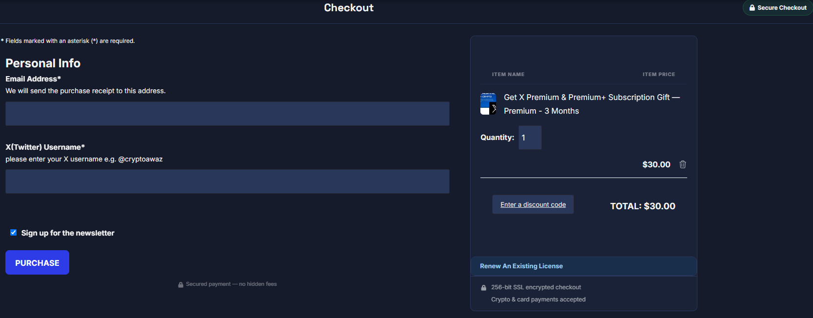

# Mayosis Child — EDD Home, Product & Checkout

A WordPress child theme for [Mayosis](https://themeforest.net/item/mayosis-digital-marketplace-wordpress-theme/26568956) that replaces the default Easy Digital Downloads **home page**, **single product** page and **checkout** with a polished, conversion-focused design — without touching the parent theme. Verified on **Mayosis 6.0**.

---

## Screenshots

### Single Product Page

| Dark | Light |
|---|---|
|  |  |

Two-column buy box with the adaptive **Plan × Duration** selector, live price, sales badge and crypto payment row.

### Live Stock & Sold-Out Variants


Per-variation stock via the EDD Purchase Limit extension — available options are priced, sold-out options are greyed and labelled, and an **In Stock / Only N left / Out of Stock** badge drives the Buy button.

### Home Page


A fully dynamic marketplace home: hero with live AJAX search, crypto price ticker, stats band and best-selling grid.

### Checkout



Two-column EDD blocks checkout with a sticky order summary, trust badges and an SSL note.

---

## Part 1 — Single Product Page

A modern, marketplace-style product page applied to **every** EDD download via a single `template_include` filter (no per-product setup, no parent-theme edits).

### Features

- **Two-column above-the-fold** — image/gallery left, buy box right; everything that matters is visible without scrolling.
- **Adaptive price selector** — reads EDD's variable prices and renders the right UI automatically:
  - **Two-axis grid** (e.g. Plan × Duration) when option names follow `Plan - Duration`, greying out combinations that don't exist.
  - **Single-axis cards** when names don't split (e.g. hardware variants).
  - **Plain price** when the product has a single price.
  - The duration axis auto-collapses when every option shares one duration.
- **Live price + "Buy Now — $X"** — updates instantly as you choose; drives EDD's native cart so checkout is 100% standard.
- **Live stock / availability** — when the **EDD Purchase Limit** extension is active, shows an **In Stock / Only N left / Out of Stock** badge. Supports **per-variation limits**: sold-out options are greyed, labelled "Sold out" and skipped, and the Buy button disables to "Out of Stock" when nothing is available. No badge is shown for products without a limit set.
- **EDD Reviews rating** — star average under the title (links to the Reviews tab); shows "No ratings yet" when empty.
- **TrustPilot strip** — official TrustPilot widget, theme-synced so it stays readable in dark mode.
- **Crypto payment badge** — BTC / ETH / USDT icons in the buy box.
- **"You might also like"** — same-category related-products grid, placed above the tabs.
- **Content tabs** — the product description is split into tabs automatically on each `<h2>` heading, followed by:
  - **Reviews** tab (EDD Reviews + login form), and
  - a distinct **Product Information** tab (dynamic EDD data + relocated FES vendor fields such as "Refund Supported").
- **Dark mode** — full `body.sp-night-mode-on` palette matching the Mayosis customizer.
- **Responsive** — single-column stack, touch-friendly controls, readable tab measure on mobile.

### How It Works

- **`template_include` filter** (`caw_force_single_product_template`) routes every `is_singular('download')` request to `caw-single-download.php`, so all products share one layout regardless of their stored page template (default / Prime / none).
- **`caw_get_price_model()`** parses `edd_get_variable_prices()`: it splits each option name on `" - "` (hyphen / en / em dash). Two clean parts → two-axis; otherwise → single-axis list. It detects which axis is a duration (month/year/week…) to label the axes, and builds a `plan|||duration → price_id` map.
- The selector UI sets the matching **native EDD checkbox/radio** and dispatches `change`; the custom **Buy Now** button clicks EDD's hidden add-to-cart button, so the native cart / checkout flow is preserved.
- **Tabs** are built by `caw_build_tabs()` from `the_content()` split on `<h2>`. FES (Frontend Submission) vendor "display field" tables are extracted from the content and relocated into the **Product Information** tab so they don't trail the last section.
- The **breadcrumb** uses the theme's own `dm_breadcrumbs()` (dynamic — reflects your EDD slug + category).
- **Dark mode** uses `body.sp-night-mode-on` overrides scoped under `.caw-product`.

### Option naming convention (for the two-axis grid)

For variable-price subscriptions, name each price option `Plan - Duration`, e.g.:

```
Pro - 1 Month
Pro - 1 Year
Max 5x - 3 Months
```

Anything that doesn't fit this pattern falls back gracefully to a single-axis card list — no configuration needed.

---

## Part 2 — Checkout

Replaces the default EDD blocks checkout with a two-column, conversion-focused layout.

### Features

- **Two-column checkout layout** — payment form left, order summary right.
- **Sticky order summary** — cart column stays visible while scrolling the form.
- **Trust badges** — SSL + payment icons in the order summary, persist through EDD's AJAX cart refresh.
- **Secure Checkout badge** + centred "Checkout" heading; **lock note** below the purchase button.
- **EDD Software Licensing** — "Renew An Existing License" form styled for dark mode.
- **EDD alert messages** — success / error / warning notices themed for dark mode.
- **Responsive** — mobile stack: heading → order summary → payment form.
- **Hides Save/Update Cart buttons** for a cleaner flow.

### How It Works

- `render_block_data` forces the EDD checkout block into `two-thirds` layout before render.
- `render_block` prepends the "Checkout" heading outside the block so it sits above both columns (and above the cart on mobile).
- Trust badges are injected into `.edd-blocks__cart` and re-injected by a `MutationObserver` after EDD's AJAX cart refresh.
- Dark mode overrides use `body.sp-night-mode-on`.

---

## Part 3 — Home Page

A bespoke, fully dynamic marketplace home page that replaces the old page-builder home, built as a child-theme `front-page.php` (no builder required).

### Sections (all dynamic, pulled live from EDD / WP)

- **Hero** — headline, live AJAX product search, Browse / Join Community CTAs, factual trust strip, and a spotlight collage of real products (Claude, X Premium, "Make Earth Green", Ledger) with live titles/prices.
- **Live crypto price ticker** — single-line BTC / ETH / USDT / BNB / SOL / XRP with 24h change (free CoinGecko API; swap-in point for the *Premium Cryptocurrency Widgets* shortcode).
- **Stats band** — product count, total orders delivered, vendor count, cryptos accepted (real numbers).
- **Best Selling** — top products by `_edd_download_sales`.
- **Newly Listed** — most recent downloads.
- **Shop by Category** — `download_category` terms with live counts + icons.
- **Why Crypto Awaz / How It Works** — value props + 3-step flow.
- **Become a Vendor** CTA band.
- **From the Crypto Blog** — latest posts.
- **Need Help? Start Here** — top FAQ topics linking to the relevant pages + the knowledge base.
- **Community** — single newsletter Subscribe button (links to the MailPoet signup page) + social chips.
- **Trustpilot** — free-tier-compliant **Review Collector** CTA only (no rating / "Excellent" claims).
- **Light + Dark mode** — matches the product/checkout palette (accent `#1e73be`); dark via `body.sp-night-mode-on`.

### How It Works

- A `template_include` filter (`caw_force_front_page_template`, priority 100) returns `front-page.php` for `is_front_page()` — needed because Elementor's page-templates module hijacks the front page at priority 11.
- All content is queried live (`WP_Query`, `get_terms`, EDD stats), so the page stays current as inventory changes.
- Live search reuses the theme's `[mayosis_edd_search]` AJAX shortcode.
- CSS is namespaced under `.cawhome` with `ch-` prefixes to avoid any collision with the theme / Bootstrap.
- Icons use **FontAwesome 5** class names (`fas` / `fab`).

---

## Global Palette

Site-wide accent colour is unified to **`#1e73be`** (matching the product/checkout pages). This is set in the **theme Customizer**, not in this repo, since Mayosis stores it as a theme mod:

- **Global Styles → Common Style → Primary Color** → `#1e73be`
- **Header → Dark/Light Mode → Site Link Color** → `#4a9fe0`, **Site Link Hover Color** → `#ffffff`

---

## Requirements

| Requirement | Version |
|---|---|
| WordPress | 5.8+ |
| [Mayosis Theme](https://themeforest.net/item/mayosis-digital-marketplace-wordpress-theme/26568956) | Any recent |
| [Easy Digital Downloads](https://easydigitaldownloads.com/) | 3.x+ (Blocks-based checkout) |
| EDD Reviews *(optional)* | for the product rating + Reviews tab |
| EDD Purchase Limit *(optional)* | for the "In Stock / Sold Out" badge + per-variation stock |
| EDD Software Licensing *(optional)* | for the license renewal form styling |
| EDD Frontend Submission (FES) *(optional)* | vendor fields shown in Product Information |

## Installation

1. Install and activate the **Mayosis** parent theme.
2. Upload the `mayosis-child` folder to `/wp-content/themes/`.
3. Go to **Appearance → Themes** and activate **Mayosis Child**.
4. Ensure your EDD checkout page uses the **EDD Checkout** block (not the legacy shortcode).

## Configuration

### EDD Downloads Slug

In `functions.php`, match your EDD permalink (**Settings → Permalinks → EDD**):

```php
define( 'EDD_SLUG', 'products' ); // change to 'downloads', 'shop', etc.
```

### TrustPilot

Set your business unit / template in `caw_trustpilot_widget()` in `functions.php` (`data-businessunit-id`, `data-template-id`, `data-token`, review URL). The widget renders the live rating on your verified domain.

### Trust Badge Text (checkout)

Edit the strings in `caw_checkout_inline_js()` in `functions.php`:

```php
'256-bit SSL encrypted checkout'
'Crypto & card payments accepted'
```

### Dark Mode Colours

Sourced from the Mayosis Customizer (**Appearance → Customize → Dark Mode**); the child theme matches them under `body.sp-night-mode-on`.

## File Overview

| File | Purpose |
|---|---|
| `functions.php` | All PHP hooks/helpers — home + single-product template routing, price model, tabs, reviews, related products, TrustPilot, checkout enhancements |
| `style.css` | All CSS — home (`.cawhome`) + product page + checkout, light/dark, responsive |
| `front-page.php` | Custom dynamic home page (routed via `template_include`) |
| `caw-single-download.php` | Custom single-product template (routed via `template_include`) |
| `checkout-template.php` | Full-width page template for the checkout page |

## Rollback

Remove the `caw_force_single_product_template` filter (or delete `caw-single-download.php`) to instantly restore the original product layout. The checkout and product enhancements are independent.

## License

MIT — free to use, modify, and distribute.
