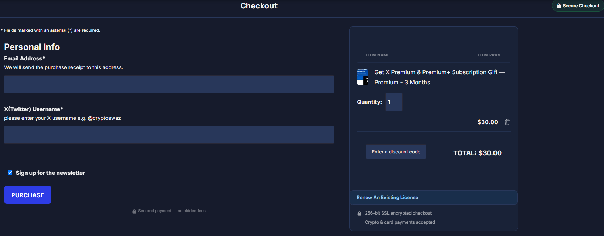

# Mayosis Child — EDD Home, Product, Checkout & Auth

A WordPress child theme for [Mayosis](https://themeforest.net/item/mayosis-digital-marketplace-wordpress-theme/26568956) that replaces the default Easy Digital Downloads **home page**, **single product** page and **checkout** with a polished, conversion-focused design, and adds **Cloudflare Turnstile** protection plus a dark-mode fix to the theme's **login/registration popup** — without touching the parent theme. Verified on **Mayosis 6.0**.

---

## Screenshots

### Single Product Page

| Dark | Light |
|---|---|
|  |  |

Two-column buy box with the adaptive **Plan × Duration** selector, live price, sales badge and crypto payment row.

### Live Stock & Sold-Out Variants


Per-variation stock via the EDD Purchase Limit extension — available options are priced, sold-out options are greyed and labelled, and an **In Stock / Only N left / Out of Stock** badge drives the Buy button.

### Home Page


A fully dynamic marketplace home: hero with live AJAX search, crypto price ticker, stats band and best-selling grid.

### Checkout



Two-column EDD blocks checkout with a sticky order summary, trust badges and an SSL note.

---

## Part 1 — Single Product Page

A modern, marketplace-style product page applied to **every** EDD download via a single `template_include` filter (no per-product setup, no parent-theme edits).

### Features

- **Two-column above-the-fold** — image/gallery left, buy box right; everything that matters is visible without scrolling.
- **Adaptive price selector** — reads EDD's variable prices and renders the right UI automatically:
  - **Two-axis grid** (e.g. Plan × Duration) when option names follow `Plan - Duration`, greying out combinations that don't exist.
  - **Single-axis cards** when names don't split (e.g. hardware variants).
  - **Plain price** when the product has a single price.
  - The duration axis auto-collapses when every option shares one duration.
- **Live price + "Buy Now — $X"** — updates instantly as you choose; drives EDD's native cart so checkout is 100% standard.
- **Live stock / availability** — when the **EDD Purchase Limit** extension is active, shows an **In Stock / Only N left / Out of Stock** badge. Supports **per-variation limits**: sold-out options are greyed, labelled "Sold out" and skipped, and the Buy button disables to "Out of Stock" when nothing is available. No badge is shown for products without a limit set.
- **EDD Reviews rating** — star average under the title (links to the Reviews tab); shows "No ratings yet" when empty.
- **TrustPilot strip** — official TrustPilot widget, theme-synced so it stays readable in dark mode.
- **Crypto payment badge** — BTC / ETH / USDT icons in the buy box.
- **"You might also like"** — same-category related-products grid, placed above the tabs.
- **Content tabs** — the product description is split into tabs automatically on each `<h2>` heading, followed by:
  - **Reviews** tab (EDD Reviews + login form), and
  - a distinct **Product Information** tab (dynamic EDD data + relocated FES vendor fields such as "Refund Supported").
- **Dark mode** — full `body.sp-night-mode-on` palette matching the Mayosis customizer.
- **Responsive** — single-column stack, touch-friendly controls, readable tab measure on mobile.

### How It Works

- **`template_include` filter** (`caw_force_single_product_template`) routes every `is_singular('download')` request to `caw-single-download.php`, so all products share one layout regardless of their stored page template (default / Prime / none).
- **`caw_get_price_model()`** parses `edd_get_variable_prices()`: it splits each option name on `" - "` (hyphen / en / em dash). Two clean parts → two-axis; otherwise → single-axis list. It detects which axis is a duration (month/year/week…) to label the axes, and builds a `plan|||duration → price_id` map.
- The selector UI sets the matching **native EDD checkbox/radio** and dispatches `change`; the custom **Buy Now** button clicks EDD's hidden add-to-cart button, so the native cart / checkout flow is preserved.
- **Tabs** are built by `caw_build_tabs()` from `the_content()` split on `<h2>`. FES (Frontend Submission) vendor "display field" tables are extracted from the content and relocated into the **Product Information** tab so they don't trail the last section.
- The **breadcrumb** uses the theme's own `dm_breadcrumbs()` (dynamic — reflects your EDD slug + category).
- **Dark mode** uses `body.sp-night-mode-on` overrides scoped under `.caw-product`.

### Option naming convention (for the two-axis grid)

For variable-price subscriptions, name each price option `Plan - Duration`, e.g.:

```
Pro - 1 Month
Pro - 1 Year
Max 5x - 3 Months
```

Anything that doesn't fit this pattern falls back gracefully to a single-axis card list — no configuration needed.

---

## Part 2 — Checkout

Replaces the default EDD blocks checkout with a two-column, conversion-focused layout.

### Features

- **Two-column checkout layout** — payment form left, order summary right.
- **Sticky order summary** — cart column stays visible while scrolling the form.
- **Trust badges** — SSL + payment icons in the order summary, persist through EDD's AJAX cart refresh.
- **Secure Checkout badge** + centred "Checkout" heading; **lock note** below the purchase button.
- **EDD Software Licensing** — "Renew An Existing License" form styled for dark mode.
- **EDD alert messages** — success / error / warning notices themed for dark mode.
- **Responsive** — mobile stack: heading → order summary → payment form.
- **Hides Save/Update Cart buttons** for a cleaner flow.

### How It Works

- `render_block_data` forces the EDD checkout block into `two-thirds` layout before render.
- `render_block` prepends the "Checkout" heading outside the block so it sits above both columns (and above the cart on mobile).
- Trust badges are injected into `.edd-blocks__cart` and re-injected by a `MutationObserver` after EDD's AJAX cart refresh.
- Dark mode overrides use `body.sp-night-mode-on`.

---

## Part 3 — Home Page

A bespoke, fully dynamic marketplace home page that replaces the old page-builder home, built as a child-theme `front-page.php` (no builder required).

### Sections (all dynamic, pulled live from EDD / WP)

- **Hero** — headline, live AJAX product search, Browse / Join Community CTAs, factual trust strip, and a spotlight collage of real products (Claude, X Premium, "Make Earth Green", Ledger) with live titles/prices.
- **Live crypto price ticker** — single-line BTC / ETH / USDT / BNB / SOL / XRP with 24h change (free CoinGecko API; swap-in point for the *Premium Cryptocurrency Widgets* shortcode).
- **Stats band** — product count, total orders delivered, vendor count, cryptos accepted (real numbers).
- **Best Selling** — top products by `_edd_download_sales`.
- **Newly Listed** — most recent downloads.
- **Shop by Category** — `download_category` terms with live counts + icons.
- **Why Crypto Awaz / How It Works** — value props + 3-step flow.
- **Become a Vendor** CTA band.
- **From the Crypto Blog** — latest posts.
- **Need Help? Start Here** — top FAQ topics linking to the relevant pages + the knowledge base.
- **Community** — single newsletter Subscribe button (links to the MailPoet signup page) + social chips.
- **Trustpilot** — free-tier-compliant **Review Collector** CTA only (no rating / "Excellent" claims).
- **Light + Dark mode** — matches the product/checkout palette (accent `#1e73be`); dark via `body.sp-night-mode-on`.

### How It Works

- A `template_include` filter (`caw_force_front_page_template`, priority 100) returns `front-page.php` for `is_front_page()` — needed because Elementor's page-templates module hijacks the front page at priority 11.
- All content is queried live (`WP_Query`, `get_terms`, EDD stats), so the page stays current as inventory changes.
- Live search reuses the theme's `[mayosis_edd_search]` AJAX shortcode.
- CSS is namespaced under `.cawhome` with `ch-` prefixes to avoid any collision with the theme / Bootstrap.
- Icons use **FontAwesome 5** class names (`fas` / `fab`).

---

## Part 4 — Auth: Login Popup, Turnstile & Social Login

Recent Mayosis versions ship an AJAX login/register/forgot-password popup (`#msv-auth-modal`, rendered by the parent theme's `header-account.php`). It arrives styled for a light page only, with no bot protection and no social sign-in. This part covers all three, plus the EDD `/login/` and `/register/` pages.

### Features

- **Night-mode popup** — dark card, readable tab bar, fields, "Remember me", forgot-password link, strength meter, divider and alert messages, all matching the checkout/product palette.
- **Field layout repair** — restores the left padding the parent theme's global `input` rule was overriding, which made the field icons sit on top of the placeholder text (visible in light mode too).
- **Cloudflare Turnstile** on every logged-out form:
  - the popup's **login**, **register** and **forgot password** forms,
  - **wp-login.php** login, register and lost-password,
  - **EDD FES** vendor login, registration and vendor-contact forms.
- **Invisible by default** — the popup uses `appearance: interaction-only`, so visitors see nothing unless Cloudflare decides a challenge is warranted. wp-login and FES show a standard widget.
- **Theme-aware widget** — renders in Turnstile's dark or light theme based on the site's night-mode cookie.
- **Admin screen** — Settings → Cloudflare Turnstile, or `wp-config.php` constants (which take priority and keep the secret out of the database).
- **Replaces reCAPTCHA** — the FES reCAPTCHA field is force-excluded site-wide. EDD Pro (3.6.1+), MailPoet and Contact Form 7 have their own native Turnstile support and are configured from their own settings screens.
- **Social sign-in** — [Nextend Social Login](https://wordpress.org/plugins/nextend-facebook-connect/) buttons in both popup panels, under the EDD login/registration blocks, and inside the checkout's login fieldset, themed for dark mode.
- **De-duplicated popup** — the parent theme emits the entire modal once per header region, so a typical header config yields two copies with duplicate element IDs.
- **`/login/` + `/register/` layout fix** — the Register button no longer overflows its card, and the password strength meter stays readable in dark mode.

### How It Works

The popup's markup lives in the parent theme and exposes **no hooks inside its forms**, and its JavaScript posts a hand-built field list rather than serialising the form — so a hidden input added to the DOM would be silently dropped. The integration works around both:

- The three widgets are **mounted client-side** by `js/caw-turnstile.js`.
- The token is attached with a **`$.ajaxPrefilter`** that appends it to the outgoing query string.
- A **capture-phase `submit` listener** on the modal runs ahead of the theme's own delegated handler and holds the submit back (showing "Verifying…" on the button) until a token exists, then re-fires it.
- Server-side, the `wp_ajax_nopriv_mayosis_mbw_lrb_ajax_*` actions are hooked at **priority 1** — ahead of the theme's handlers — and answer in the JSON shape the popup's JavaScript expects.
- `wp-login.php` is guarded via `authenticate`, `registration_errors` and `lostpassword_post`. The `authenticate` check deliberately does **not** defer to an existing credential error: otherwise a bot could grind passwords without ever meeting the captcha, since core reports "wrong password" first.
- Verification results are **memoised per token**. Turnstile tokens are single-use, so a request that passes through two guards must not spend its token twice.
- A transport failure (Cloudflare unreachable) is treated as a **pass**; an explicit `success: false` always fails. Failing closed on a network blip would lock every customer out of login and checkout. Override with the `caw_turnstile_fail_open` filter.
- Dark-mode CSS uses `!important` throughout — `sp-night-mode` emits a blanket `body.sp-night-mode-on * { color: … !important }` that no amount of specificity can outrank. That rule also reaches *inside* Nextend's buttons (the `<b>` around the provider name), so social button labels are re-coloured from Nextend's own `data-skin` attribute rather than a hard-coded provider list.
- **Social buttons in the popup** are not injected — the parent theme already renders an "or continue with" divider followed by `[edd_social_login]` in both panels, gated on that shortcode existing. It's a hook left for EDD's own social add-on; aliasing it onto `[nextend_social_login]` lights up the existing markup with no template edit. A real EDD social add-on, if ever activated, keeps the shortcode and the bridge stands down.
- **Duplicate modals** are removed by a short inline script attached *before* the theme's own auth script, so the extra copies are gone before anything binds to them. Both the theme's script and ours resolve the modal and form IDs with `getElementById`, which returns only the first match — leaving the duplicate would mean a second set of forms that never receives a Turnstile widget.
- **Checkout social buttons are relocated, not added** — and this needs one plugin setting, see Configuration below. Nextend renders its own set from its EDD *checkout* integration, whose position choices are all whole-form (`edd_checkout_form_top`, `edd_purchase_form_before_email`, `…_before_submit`, `…_after_submit`), so they land above Personal Info rather than by the login form. Its `edd_login` setting *does* offer before/after the login fields, but that hooks `edd_login_fields_after`, which EDD fires only for the standalone login block and shortcode — the checkout fires `edd_checkout_login_fields_after`. So the placement isn't reachable from Nextend's settings, and the theme renders them at the login fieldset instead.
- The `/register/` overflow was a CSS collision, not a bug in either party: EDD's block CSS makes the submit row `display:flex; flex-wrap:nowrap`, while the parent theme sets `.edd-submit { min-width:100% }`. A flex item that may not shrink below 100%, next to a sibling button, overflows by exactly that sibling's width.

### Filters

| Filter | Purpose |
|---|---|
| `caw_turnstile_enabled` | Disable Turnstile for one form (`$context`, e.g. `msv_login`, `wp_register`, `fes_login`) |
| `caw_turnstile_widget_args` | Override `appearance` / `size` per context |
| `caw_turnstile_fail_open` | Fail closed instead of open when Cloudflare is unreachable |
| `caw_turnstile_error_message` | Change the failure message |

---

## Part 5 — Crypto News (RSS)

`caw-crypto-news.php` — a selectable **Page Template: "Crypto News (RSS)"**.

Replaces a paid crypto-widget plugin whose CryptoCompare key sat on the free tier (25 calls/month) and had long been exhausted, so every widget fetched an error and rendered empty while still shipping 514 KB of CSS+JS on *every* page of the site.

### Features

- Merges **Cointelegraph, Decrypt and CoinDesk** into one date-sorted list, capped at 24 items.
- Core `fetch_feed()` / SimplePie — **no API key, no rate limit, no third-party JavaScript**.
- 5-second feed timeout and a 30-minute transient cache, so a stalled publisher can never hold the page open.
- A dead feed is skipped, never fatal; failures are reported only to logged-in admins.
- Reuses `.ch-blog-grid` / `.ch-post` from the home page, so it ships **no CSS of its own** and inherits night mode.

### Setup

1. Edit the target page → **Page Attributes → Template → Crypto News (RSS)**.
2. Clear the page content (the template does not render `the_content`).

### Filters

| Filter | Purpose |
|---|---|
| `caw_crypto_news_feeds` | Replace the feed list (`array( 'Label' => 'https://…/feed' )`) |
| `caw_crypto_news_limit` | Change the item cap (default `24`) |

> Bitcoin Magazine's feed is deliberately omitted — it returns `403` to server-side requests.

If the plugin is ever removed entirely, `functions.php` registers `[cryptocurrency_widget]` as a no-op so orphaned shortcodes in old content do not print as literal text. It is guarded by `shortcode_exists()`, so reactivating the plugin hands the tag straight back.

---

## Global Palette

Site-wide accent colour is unified to **`#1e73be`** (matching the product/checkout pages). This is set in the **theme Customizer**, not in this repo, since Mayosis stores it as a theme mod:

- **Global Styles → Common Style → Primary Color** → `#1e73be`
- **Header → Dark/Light Mode → Site Link Color** → `#4a9fe0`, **Site Link Hover Color** → `#ffffff`

---

## Performance

### Cloudflare Cache Rules — caching HTML without breaking EDD

> ⚠️ **Read this before touching Cache Rules.** An EDD store renders per-visitor state into the HTML. Cache it carelessly and you will serve one shopper's cart — or a logged-in page — to everybody.

WordPress HTML is `cf-cache-status: DYNAMIC` by default: Cloudflare never caches it, so every visit pays a full edge→origin round trip. On this site that measured **1.73 s TTFB**; with the rule below it is **0.119 s** — a ~14× improvement. The origin itself was never slow (WP generates the page in ~96 ms); the entire cost was the round trip.

**Use one rule with a fully negated expression, not a cache rule plus separate bypass rules.** When several Cache Rules match the same request you have to reason about which wins — and getting that backwards is exactly the failure that leaks a logged-in page to guests. If the "cache" rule's own expression already excludes everything, no request can match both, and rule precedence stops mattering.

**Caching → Cache Rules → Create rule** — place it **last**.

```
(http.host eq "example.com")
and not (
  http.cookie contains "wordpress_logged_in"
  or http.cookie contains "edd_items_in_cart"
  or http.cookie contains "edd_session"
  or http.cookie contains "wp-postpass_"
  or http.cookie contains "comment_author_"
  or http.request.uri.path contains "/wp-admin"
  or http.request.uri.path contains "/wp-login.php"
  or http.request.uri.path contains "/wp-json"
  or http.request.uri.path contains "/checkout"
  or http.request.uri.path contains "/purchase-confirmation"
  or http.request.uri.path contains "/purchase-history"
  or http.request.uri.path contains "/transaction-failed"
  or http.request.uri.path contains "/account"
  or http.request.uri.path contains "/vendor"
  or http.request.uri.path contains "/login"
  or http.request.uri.path contains "/register"
  or http.request.uri.query contains "edd_action"
  or http.request.uri.query contains "eddfile"
  or http.request.uri.query contains "add-to-cart"
  or http.request.uri.query contains "preview"
)
```

| Setting | Value | Why |
|---|---|---|
| Cache eligibility | **Eligible for cache** | WP sends no `Cache-Control` on HTML, so nothing caches without this |
| Edge TTL | **Ignore cache-control header and use this TTL → 2 hours** | With no origin header, "use header if present" would cache nothing |
| Browser TTL | **Respect origin TTL** | Never give HTML a long browser TTL — a CF purge cannot clear it |

Then **Caching → Configuration → Purge Everything** once.

#### Why each exclusion is there

- **`edd_items_in_cart`** — the one people miss. EDD sets this cookie for 30 minutes whenever the cart is non-empty (`src/Sessions/Traits/Cookie.php`). The header renders the count as literal HTML (`<span class="edd-cart-quantity">0</span>`), so without this a shopper with items in their cart is served a cached header reading **0**. Cloudflare **APO does not cover this** — its built-in bypass list handles `wordpress_*`, `woocommerce_*` and `comment_*`, but has no knowledge of EDD.
- **`edd_session`** — any visitor with EDD session state.
- **`eddfile`** — EDD's signed file-delivery URLs. Caching one would serve a paid download from the edge.
- **`edd_action`** — add-to-cart, discount apply, gateway switching.
- **`preview`** — so draft previews are never cached while editing.
- **`wordpress_logged_in`** — never cache an authenticated response.

#### What does *not* need excluding

- **Night mode** — applied client-side; the server sends an identical `<body class>` with or without the `wpNightMode` cookie, so cached HTML cannot serve the wrong theme.
- **Nonces** — present in the HTML but shared across logged-out visitors, so they are safe to cache as long as logged-in users are excluded.
- **Product and archive pages** — fully cacheable, and they are the heaviest pages on the site.

#### Do not enable "bypass all query strings"

A rule of `len(http.request.uri.query) > 0` looks safe but destroys the cache hit rate: every `?utm_source=`, `?fbclid=` and `?gclid=` link from a campaign skips cache entirely. The four targeted query conditions above cover the genuinely unsafe cases.

#### Verifying

```bash
# should be MISS then HIT
curl -sI https://example.com/ | grep -i cf-cache-status
curl -sI https://example.com/products/ | grep -i cf-cache-status

# must NOT be HIT
curl -sI -b "edd_items_in_cart=1" https://example.com/ | grep -i cf-cache-status
curl -sI https://example.com/checkout/ | grep -i cf-cache-status
```

Run these from **outside** the origin. Running `curl` on the web server itself resolves the domain to localhost, returns no `cf-*` headers at all, and tells you nothing about the edge.

Finish with a manual pass: add a product to the cart, load the home page, and confirm the header count is right. No automated check catches that.

### Asset trimming

`functions.php` drops weight that nothing on the page uses:

| Function | Effect |
|---|---|
| `caw_drop_duplicate_child_stylesheet` | The parent enqueues `get_stylesheet_uri()` as `mayosis-style`, which in a child theme resolves to **this theme's** `style.css` — so it shipped twice. Blanks the parent's `src` rather than deregistering it, so handles that declare it as a dependency still resolve. |
| `caw_disable_frontend_emoji` | Removes the emoji detection script, its stylesheet and the `s.w.org` dns-prefetch on the front end. Admin untouched. |
| `mailpoet_display_custom_fonts` → `false` | MailPoet enqueues its **entire font-picker list — 62 families across 3 `fonts.googleapis.com` stylesheets** — on every front-end request, just so the form editor can preview them. Three render-blocking cross-origin requests for fonts no form uses. Filtered off rather than using the Settings toggle, because the underlying `3rd_party_libs.enabled` setting also gates MailPoet's admin DocsBot widget and the email editor's libraries. If a form ever needs a Google font, self-host that one family instead. |
| `caw_dequeue_elementor_where_unused` | Drops Elementor's entire front-end bundle on pages **this theme renders itself** — the front page and single downloads. Elementor still enqueues everything on those pages because the underlying post carries `_elementor_data`, even though no widget runs. See below. |

#### Elementor on pages we render ourselves

`front-page.php` and `caw-single-download.php` replace the page output entirely, so no Elementor widget executes — but Elementor still queues its whole bundle: `frontend.min.js`, `frontend-modules.min.js`, `webpack.runtime.min.js`, the Kit CSS, the page CSS, eicons, three Font Awesome files and five locally-hosted Google fonts.

Gated by `caw_page_renders_without_elementor()`, which is filterable. **Verified before shipping**: the home page and a product page contain zero Elementor DOM nodes once `<style>`/`<script>` blocks are stripped — the selectors only ever appear inside CSS — while `/about-us/` has 60 and `/contact/` 21, so those pages are deliberately untouched. Elementor Pro is not installed, so there are no theme-builder header/footer templates to break.

Two passes are required: most handles are queued on `wp_enqueue_scripts`, but the Kit fonts and Font Awesome arrive later, so a second pass runs on `wp_print_styles` — the last moment before `WP_Styles::do_items()`.

**Elementor's Font Awesome is safe to drop** because the parent theme already ships a complete FA5 at `mayosis/css/all.min.css`: both the Brands and Free families, every glyph `front-page.php` uses, and a populated `webfonts/` directory. Keeping both is a pure duplicate. Body classes (`elementor-page`, `elementor-kit-*`) are untouched, so any CSS keying off them still works.

Result on the home page: **42 → 26 stylesheets**, with all 55 Font Awesome icons still rendering.

#### Front-page-only dequeues

`caw_dequeue_front_page_extras` drops what `front-page.php` has nothing to act on — bbPress, Contact Form 7 (styles, script and the `swv` validation runtime), Plyr, Swiper, BeerSlider, the sale counter and its FlipClock dependency, EDD user profiles, EDD Recurring, the AIOSEO table-of-contents CSS, and EDD Reviews together with dashicons.

Filterable via `caw_front_page_dequeue_styles` / `caw_front_page_dequeue_scripts`.

Scoped to the front page deliberately — Swiper and Plyr drive the product gallery and media previews, and EDD Reviews powers the Reviews tab, so `caw-single-download.php` still needs all three.

Two things worth knowing:

- **MailPoet is deliberately *not* dequeued.** The front page carries a real popup subscribe form (`mailpoet_form_form mailpoet_form_popup`, overlay plus slide-up animation), so its ~39 KB is load-bearing. It looks unused if you only read handle names.
- **dashicons can only go together with `edd-reviews`**, which declares it as a dependency in `AssetLoader.php`. Dequeuing dashicons on its own does nothing — WP's dependency resolver re-adds it. Our star ratings need neither: `caw_product_rating()` reads the average through `edd_reviews()->average_rating()` and draws Font Awesome stars.

Result on the home page: **26 → 15 stylesheets**, 64 → 43 CSS/JS files.

> **Verify DOM, not handle names.** Grepping raw HTML for a framework's classes gives false positives, because the selectors appear inside `<style>` blocks and in the `<link>` tags' own URLs. Strip `<style>`, `<script>`, `<link>` and `<meta>` first, then count. Doing this flipped two conclusions during this work — Elementor on the home page looked used (7 apparent matches, actually 0) and MailPoet looked unused (actually a live popup form).
| `caw_stub_dead_crypto_widget_shortcode` | No-op for `[cryptocurrency_widget]` when the plugin is inactive (see Part 5). |

---

## Requirements

| Requirement | Version |
|---|---|
| WordPress | 5.8+ |
| [Mayosis Theme](https://themeforest.net/item/mayosis-digital-marketplace-wordpress-theme/26568956) | Any recent |
| [Easy Digital Downloads](https://easydigitaldownloads.com/) | 3.x+ (Blocks-based checkout) |
| EDD Reviews *(optional)* | for the product rating + Reviews tab |
| EDD Purchase Limit *(optional)* | for the "In Stock / Sold Out" badge + per-variation stock |
| EDD Software Licensing *(optional)* | for the license renewal form styling |
| EDD Frontend Submission (FES) *(optional)* | vendor fields shown in Product Information; Turnstile on the vendor forms |
| [Cloudflare Turnstile](https://dash.cloudflare.com/?to=/:account/turnstile) *(optional)* | free; site + secret key for the login popup and wp-login.php |
| [Nextend Social Login](https://wordpress.org/plugins/nextend-facebook-connect/) *(optional)* | social buttons in the popup and on the login/register pages |

## Installation

1. Install and activate the **Mayosis** parent theme.
2. Upload the `mayosis-child` folder to `/wp-content/themes/`.
3. Go to **Appearance → Themes** and activate **Mayosis Child**.
4. Ensure your EDD checkout page uses the **EDD Checkout** block (not the legacy shortcode).

## Configuration

### EDD Downloads Slug

In `functions.php`, match your EDD permalink (**Settings → Permalinks → EDD**):

```php
define( 'EDD_SLUG', 'products' ); // change to 'downloads', 'shop', etc.
```

### TrustPilot

Set your business unit / template in `caw_trustpilot_widget()` in `functions.php` (`data-businessunit-id`, `data-template-id`, `data-token`, review URL). The widget renders the live rating on your verified domain.

### Trust Badge Text (checkout)

Edit the strings in `caw_checkout_inline_js()` in `functions.php`:

```php
'256-bit SSL encrypted checkout'
'Crypto & card payments accepted'
```

### Cloudflare Turnstile

Create a widget in the [Cloudflare dashboard](https://dash.cloudflare.com/?to=/:account/turnstile), add your domain(s) to its hostname list, then either paste the keys into **Settings → Cloudflare Turnstile**, or — preferred — define them in `wp-config.php`, which takes priority and keeps the secret out of the database:

```php
define( 'CAW_TURNSTILE_SITE_KEY',   '0x4AAAA…' );
define( 'CAW_TURNSTILE_SECRET_KEY', '0x4AAAA…' );
```

With either key missing, Turnstile no-ops entirely — a half-configured site gets no captcha rather than a locked-out login.

For local development use Cloudflare's public test keys (`1x00000000000000000000AA` / `1x0000000000000000000000000000000AA`); real widgets are hostname-locked and will error on a `.local` domain.

**Other plugins keep their own keys** — each reads its own settings and none can be fed from `wp-config.php`:

| Plugin | Where |
|---|---|
| EDD Pro | Downloads → Settings → Misc → Captcha (select *Cloudflare Turnstile*) |
| MailPoet | Settings → Advanced → CAPTCHA |
| Contact Form 7 | Contact → Integration → Turnstile |

### Nextend Social Login

Set the **Easy Digital Downloads → checkout** position to **"No connect button"**. The theme renders the buttons inside the checkout's login fieldset instead (see Part 4); leaving Nextend's own checkout integration enabled produces two sets, one of them at the top of the purchase form.

> **If MailPoet is active**, turn **off** MailPoet → Settings → Advanced → *Protect registration forms*. MailPoet validates `registration_errors` with its own call to Cloudflare, and Turnstile tokens are single-use — leaving it on means the second call fails and wp-login.php registration breaks for everyone.

### Migrating off reCAPTCHA

This theme suppresses the FES reCAPTCHA field, but FES will keep trying to validate a Google token that is no longer being submitted. Clear it at **Downloads → Settings → FES → Integrations**: empty both key fields, and untick *reCAPTCHA on the login form* and *reCAPTCHA on the vendor contact form*.

To confirm nothing is left, load each logged-out page and check that `google.com/recaptcha` appears nowhere in the source: the home page, `wp-login.php` (plus `?action=register` and `?action=lostpassword`), the vendor dashboard, checkout and any contact page.

### Dark Mode Colours

Sourced from the Mayosis Customizer (**Appearance → Customize → Dark Mode**); the child theme matches them under `body.sp-night-mode-on`.

## File Overview

| File | Purpose |
|---|---|
| `functions.php` | All PHP hooks/helpers — home + single-product template routing, price model, tabs, reviews, related products, TrustPilot, checkout enhancements |
| `style.css` | All CSS — home (`.cawhome`) + product page + checkout + auth popup, light/dark, responsive |
| `front-page.php` | Custom dynamic home page (routed via `template_include`) |
| `caw-single-download.php` | Custom single-product template (routed via `template_include`) |
| `checkout-template.php` | Full-width page template for the checkout page |
| `caw-turnstile.php` | Cloudflare Turnstile — widget rendering, verification, form guards, settings screen |
| `js/caw-turnstile.js` | Mounts the Turnstile widgets and carries the token through the popup's AJAX |

## Rollback

Each part is independent:

- **Product page** — remove the `caw_force_single_product_template` filter, or delete `caw-single-download.php`.
- **Home page** — remove the `caw_force_front_page_template` filter, or delete `front-page.php`.
- **Crypto News** — switch the page back to the default template, or delete `caw-crypto-news.php`.
- **Asset trimming** — delete `caw_drop_duplicate_child_stylesheet` and/or `caw_disable_frontend_emoji`; both simply stop taking effect.
- **Cloudflare caching** — disable the Cache Rule and purge everything. Nothing in this repo depends on it.
- **Turnstile** — clear the keys (Settings → Cloudflare Turnstile, or the `wp-config.php` constants) and every guard no-ops. To remove it completely, drop the `require_once` for `caw-turnstile.php` from `functions.php`. The popup's dark-mode fix lives in `style.css` and is unaffected either way.

## License

MIT — free to use, modify, and distribute.
